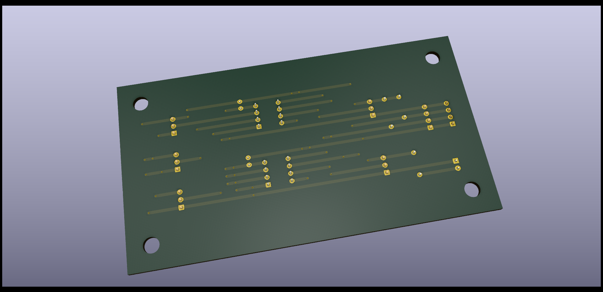

# JiggleSoft's Atari 2600

## Memory Card USB Interface - Hardware, Firmware, and Software.

### Introduction

This repository contains the design and implementation details of a USB interface and software management tool for Atari 2600/7800 memory cards, namely the SaveKey and SaveKey+.

The aim of this project is to provide the cheapest and simplest complete management solution for Atari 2600/7800 memory cards (SaveKey) devices.

### Status

I am currently awaiting delivery of Microchip PIC MCU and Microchip Serial EEPROM integrated circuits, but there is a long lead time.
In the meantime work will proceed on soldering a USB Interface Tool development stripboard PCB and a savekey plus test device stripboard PCB.
Then software development will continue.

### Project Index

| Location                  | Description                                                                |
|---------------------------|----------------------------------------------------------------------------|
| memory-card-tool/hardware | USB interface's hardware design and implementation: Schematic, PCB, Notes. |
| memory-card-tool/firmware | USB interface's firmware source code.                                      |
| memory-card-tool/software | Memory Card management tool software for Linux and Windows.                |
| savekey-plus-test-device  | SaveKey+ test device's hardware design and implementation: Schematic, PCB (stripboard), Notes. |

*Note: that this repository will only be updated with content as specific milestones are reached.*
*The development is in progress and currently housed in a separate private repository.*

### Hardware

### Software

### SaveKey Plus Test Device

[SaveKey Plus Test Device Schematic](savekey-plus-test-device/hardware/kicad/savekey-plus-test-device/savekey-plus-test-device-schematic.pdf "SaveKey Plus Test Device Schematic")

### Licensing

Copyright (C) 2022 Justin Lane
All rights reserved.

*Note: A more applicable open license will be chosen in the future.*

### Contact Us

Please email atari2600@jigglesoft.co.uk regarding this repository.

